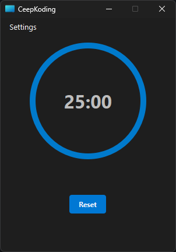

# CeepKoding



A modern Pomodoro timer application designed to help developers stay productive while promoting healthy work habits. Features intelligent activity suggestions during breaks and seamless system integration.

## Features

- 🕒 Circular progress timer with elegant UI
- 🍅 Pomodoro sessions (25min default)
- ☕ Short (5min) and long (15min) breaks
- 💡 Activity suggestions during breaks:
  - Stretching exercises
  - Eye rest techniques
  - Breathing exercises
  - Posture reminders
  - Hydration prompts
- 🎹 Keyboard shortcuts (Ctrl+S/P/R)
- 🔔 System tray integration with notifications
- ⚙️ Customizable timer durations and settings
- 🔊 Sound notifications (with custom sounds)
- 🔄 Auto-restart sessions option
- 🖥️ Cross-platform (Windows/macOS/Linux)

## Installation

### Requirements
- Python 3.6+
- PySide6

### Steps
1. Clone repository:
   ```bash
   git clone https://github.com/FLGCAPULI/ceepkoding.git
   cd ceepkoding
2. Install dependencies:
   ```bash
   pip install PySide6
3. Run application:
   ```bash
   python main.py

## Usage

### Controls

Start: Hover timer + click "START" or Ctrl+S

Pause/Resume: Hover timer + click "PAUSE/RESUME" or Ctrl+P

Reset: Click Reset button or Ctrl+R

Stop Alarm: Click "Stop Alarm & Continue" when session completes

### Session Flow

1. Work during Pomodoro session (25min)
2. Take short break (5min) with suggested activity
3. After 4 Pomodoros, take long break (15min)
4. Repeat cycle

## Configuration

Access settings via ```Menu > Settings > Preferences:```

- Customize timer durations
- Set Pomodoros before long break
- Toggle auto-restart
- Enable/disable sounds
- Switch between dark/light mode

## Keyboard Shortcuts
Shortcut	Action
Ctrl + S	Start Timer
Ctrl + P	Pause/Resume
Ctrl + R	Reset Timer

## Dependencies

- [PySide6](https://pypi.org/project/PySide6/) - Qt framework bindings
- Python standard libraries

## Acknowledgments

- Pomodoro Technique® by Francesco Cirillo

- Qt/PySide6 framework

- Inspired by various productivity tools

**Important Legal Note:**  
This application implements the Pomodoro Technique® time management method.  
Pomodoro Technique® and Pomodoro™ are registered trademarks of Francesco Cirillo.  
This project is not affiliated with, endorsed by, or sponsored by Francesco Cirillo or pomodorotechnique.com.


